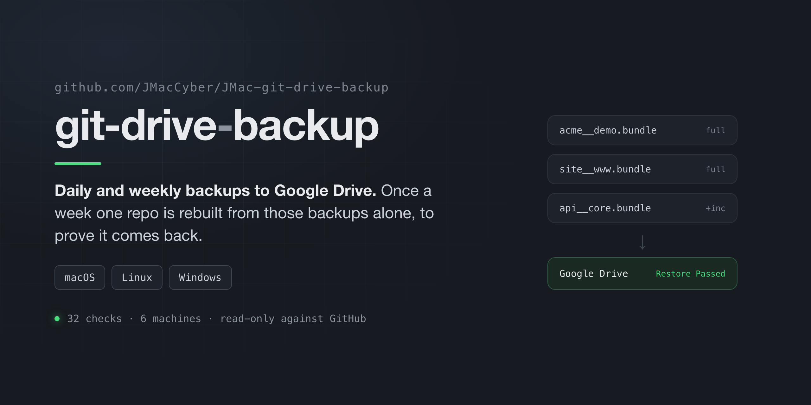
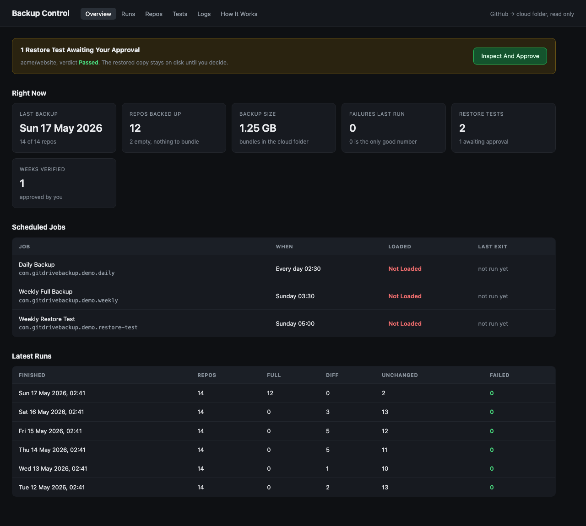
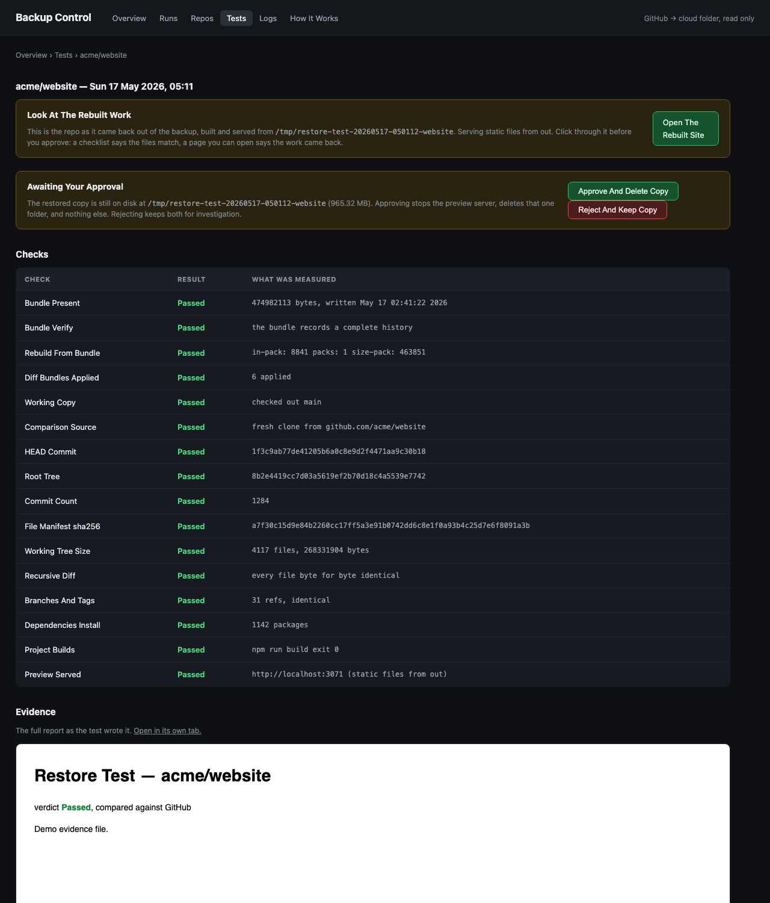

# JMac-git-drive-backup

[](https://github.com/JMacCyber/JMac-git-drive-backup/actions/workflows/test.yml)
[](https://github.com/JMacCyber/JMac-git-drive-backup/releases)
[](LICENSE)



**Daily and weekly backups of every GitHub repo to your Google Drive, with a full rebuild
once a week that proves a copy really comes back.**

GitHub holds your work. It is one company, one account, one password. If the account
locks, or a token leaks, or you delete the wrong thing, it can all go at once. This makes
a second copy somewhere else, and it checks that copy instead of hoping.

Free. It uses git, Python and the scheduler already on your machine. It starts no paid
service. It never writes to GitHub, and it never deletes anything of yours. Runs on macOS,
Linux and Windows.



---

## What You Get

1. **Every repo, with its history.** Not a zip of today's files. A git bundle, which holds
   every commit, branch and tag. You can `git clone` a bundle like it was GitHub.
2. **A page that tells you the truth.** A small website on your own machine at
   `localhost:3070`. Last run, how many repos, how big, what failed, and the file each
   number came from.
3. **A weekly proof.** Every Sunday it takes one repo, rebuilds it from the backup alone,
   and compares it against GitHub file by file.
4. **The rebuilt work, on screen.** After the test builds the repo it serves it on
   localhost so you can click through it. A checklist says the files match. A page you can
   open says the work came back.
5. **You decide when the test copy goes.** Nothing is deleted until you press Approve.

## What You Do

Four things, once:

1. Install the GitHub command line tool and sign in.
2. Copy `config.env.example` to `config.env` and put in your Google Drive folder's path.
3. Run `bash install.sh`.
4. List the repos you want tested, one per line, in the rotation file it makes for you.

After that, once a week:

- Open the dashboard. If a test is waiting, click through the rebuilt site, then press
  **Approve** or **Reject**. That is the whole job.

## Install

```bash
git clone https://github.com/JMacCyber/JMac-git-drive-backup.git
cd JMac-git-drive-backup
cp config.env.example config.env
# open config.env and set CLOUD_DIR to your Google Drive folder
bash install.sh --check     # tells you what is missing, changes nothing
bash install.sh             # sets it up and starts the dashboard
```

You need: macOS, Linux or Windows, git, Python 3, and the
[GitHub CLI](https://cli.github.com) signed in with `gh auth login`. The check step names
anything you are missing. On Windows, run these from Git Bash, which
[Git for Windows](https://gitforwindows.org) installs with git.

Read [docs/SETUP.md](docs/SETUP.md) for the longer walk-through, including how to find
your Google Drive folder's real path.

## What Runs, And When

| When | What happens |
|---|---|
| Every day, 02:30 | Backs up anything that changed since the last run |
| Sunday, 03:30 | Writes a fresh full bundle for every repo |
| Sunday, 05:00 | Restore test: rebuilds one repo, checks it, serves it |
| Always | The dashboard, on `localhost:3070` |

On macOS the times are in the four files in `launchd/`, on Linux in `systemd/`. On Windows
`install.sh` passes them to Task Scheduler, so change them in Task Scheduler or reinstall.

## The Weekly Test, Step By Step



1. Take the next repo on your list.
2. Check the bundle file is there and passes `git bundle verify`.
3. Rebuild the repo from that bundle **only**. The original checkout is not touched or
   read.
4. Clone the same repo fresh from GitHub to compare against.
5. Compare: the latest commit, the whole file tree, the number of commits, a checksum of
   every file, every branch and tag, and a full recursive diff.
6. Try to build it. `npm install` and `npm run build` for a Node project, compile every
   file for a Python one.
7. Serve the result on a spare port so you can look at it.
8. Write an HTML report and a record marked **Pending**.
9. Wait. It deletes nothing.

When you press Approve, it stops that one preview server and deletes that one folder in the
system temp directory. Nothing else, ever. Reject keeps both so you can dig into them.

## Safety Rules It Follows

- **Read-only against GitHub.** Every mirror has its push URL set to `no_push`, so a push
  fails before it reaches the network. No issue, branch or repo is ever changed.
- **Nothing in your Google Drive folder is deleted.** Replaced bundles move to `archive/` with a
  line in a README saying what moved, when, and why.
- **One delete, and you own it.** The only thing this tool ever removes is a folder named
  `restore-test-<id>` sitting in the system temp directory, after you approve it on screen.
  If the folder fails that description the dashboard refuses, and says why on the page.
- **No paid services.** Nothing here signs you up for anything.
- **Previews do not run your code.** By default the preview is a plain static file server,
  so opening it cannot execute anything out of the backup. Turning that off is opt-in and
  explained in [docs/HOW-IT-WORKS.md](docs/HOW-IT-WORKS.md).

## Honest Limits

- Three schedulers, one for each system: `launchd` on macOS, systemd user timers on Linux,
  Task Scheduler on Windows. There is one set of scripts, not three, and they are bash.
- On Linux the timers only run while you are logged in, unless you turn on lingering:
  `loginctl enable-linger $USER`.
- On Windows the jobs need Git Bash, which comes with git. Command Prompt and PowerShell
  cannot run them. The dashboard is Python and opens the same way everywhere.
- A green week proves one repo rebuilt on one machine on one day. It says nothing about the
  repos it did not test that week. The dashboard says so on the page.
- It writes to a plain folder, so Dropbox, iCloud Drive or OneDrive work the same way.
  Nothing here calls a Google API. Google Drive is what these instructions assume.
- A repo with no commits has nothing to bundle. Those are listed separately so an
  unexplained gap never sits on the page looking like a failure.
- Google is still one company. If you want a copy that survives them too, point
  `CLOUD_DIR` at an external disk and run a second copy of this.

## Is It Tested

Yes, on every push, on six machines: Ubuntu 24.04, Ubuntu 22.04, macOS 14, macOS 15,
Windows Server 2022 and Windows Server 2025. The test builds a throwaway repo, bundles it,
rebuilds it from that bundle alone, serves the rebuilt copy, opens the dashboard, tries to
approve it from a page that is not the dashboard and is refused, then approves it properly
and checks the preview stopped and the temporary copy was removed. 32 checks, and the run
is red if one fails.

Run the same test yourself, in about 20 seconds:

```bash
bash tests/selftest.sh
```

It touches nothing of yours. Everything it makes lives in one temporary folder, and it
never contacts GitHub.

## Documents

- [docs/SETUP.md](docs/SETUP.md) — install, in full, with the common mistakes
- [docs/HOW-IT-WORKS.md](docs/HOW-IT-WORKS.md) — what every file does, and how to restore by hand
- [docs/WHY.md](docs/WHY.md) — why it is built this way
- [docs/SCREENSHOTS.md](docs/SCREENSHOTS.md) — every screen, with what it shows

## Versions

`v1.0.0`, 2026-09-22. The first release. It runs on macOS, Linux and Windows, and all
32 checks pass on six machines.

`main` is where the work lands and every push is tested. To pin to the release instead:

```bash
git clone --branch v1.0.0 https://github.com/JMacCyber/JMac-git-drive-backup.git
```

## Licence

MIT. Use it, change it, sell it. No warranty: test your own restores.
